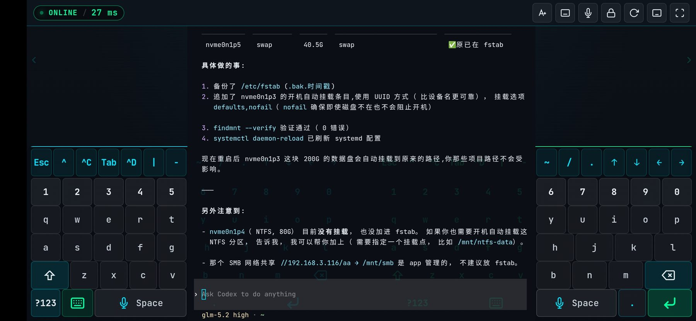
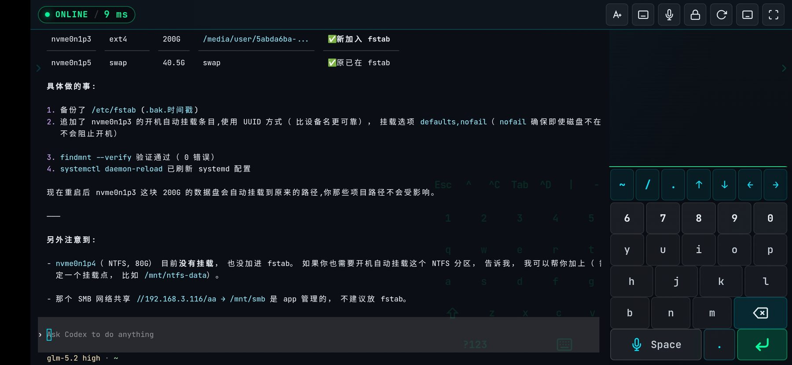
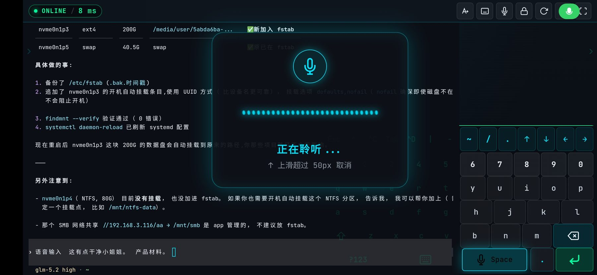

# ⚡ WebTerm // Cyberpunk 极客移动全能终端系统

<p align="center">
  
</p>

<p align="center">
  <a href="https://github.com/xxmyshf/webtram"></a>
  <a href="#"></a>
  <a href="#"></a>
  <a href="#"></a>
  <a href="#"></a>
</p>

> 专为手机、平板与触控设备深度重构的 **赛博朋克极客 Web 终端**。  
> 独创**横屏左右分体双全键盘**、**全息声波中文语音输入**、**高效运维 CLI 虚拟键盘**，并将整个前后端完全打包为 **2.1MB 的单一可执行 JS**，实现零配置、自释放、开箱即用。

---

## ⚡ 极速启动 (One-Line Quickstart)

无需配置任何繁琐环境，只要机器安装了 Node.js（v18+），在终端中执行一行命令即可完成安装并立即启动：

```bash
curl -fsSL https://raw.githubusercontent.com/xxmyshf/webtram/master/install.sh | bash
```

> 💡 **自定义端口启动**：
> ```bash
> curl -fsSL https://raw.githubusercontent.com/xxmyshf/webtram/master/install.sh | bash -s -- --port 8080
> ```

脚本将自动准备单文件服务并在当前目录生成配置文件及前端托管文件，随后启动带自签名 SSL/TLS 证书的终端服务。

---

## 🌟 核心交互创新与视觉体系

### 1. 独创横屏双侧分体全键盘 (Dual Full Split Keyboard)

移动端横屏打字时，“双手握持够不着屏幕中央按键、长文本输入手酸”是困扰业界的痛点。传统方案往往只将键盘居中或简单从中间切成两半，单手跨度仍然极大。

<p align="center">
  
</p>

- **左右各有一套完整键位**：打破切半局限，**左侧与右侧各包含一套完整的字母、数字及符号键位**！无论单手操作还是双手配合，左手右手都能随时盲打触达任何按键，拇指活动幅度缩减 60% 以上。
- **内外渐变与 10% 极弱透光**：键盘中央内侧按键背景采用 **100% 全透明底色**，文字与图标仅保留 **10% 微弱半透明透光**，终端输出的代码和日志清晰无阻穿透显示。
- **键盘区直接手势滚动终端**：半透明内侧按键区域绑定触摸松开判定，手指在键盘上直接滑动即可**无缝滚动后方终端的滚动条与历史输出**，松手仅在原地轻按才触发键位，绝不产生误触。
- **瞬亮与 2 秒柔和渐暗反馈**：敲击半透明键位时瞬间以霓虹高亮确认，随后 2 秒内柔和自动暗回 10% 亮度，既有精准操作感知，又绝不遮盖代码。

---

### 2. 极简悬浮折叠与视野极致释放

在横屏高密度信息场景下，每一像素的纵向视野都极其宝贵。

<p align="center">
  
</p>

- **左右独立收缩**：点击键盘工具栏内联折叠键，左侧或右侧键盘可平滑滑出屏幕边缘隐藏。
- **空间完整归还终端**：收起侧的占位宽度 100% 自动扩展给中央的终端容器，行宽自适应拉满。
- **边缘微小悬浮呼出**：收起后仅在屏幕边缘中央保留极小、超半透的悬浮展开图标，轻触即展，完全避开与终端文字的重叠冲突。
- **横竖屏按键高度精准对齐**：横屏按键高度统一固定为 `38px`（屏幕高度 $\le 400px$ 时自动微调为精致紧凑的 `34px`），杜绝传统网页横屏拉伸为巨大按钮的尴尬。

---

### 3. 全息声波 HUD 中文语音输入 (Long-Press Voice Input)

双手不便敲击命令行时，直接按住空格说话即可飞速输入中文或指令。

<p align="center">
  
</p>

- **无缝手势时序**：
  - **短按 (<400ms)**：标准空格键行为。
  - **长按 ($\ge$400ms)**：触发 `vibrate(30)` 微触觉振动，屏幕中央浮现全息毛玻璃声波 HUD。
- **Canvas 实时全息波形**：随环境音量与语音振幅实时律动，科技感拉满。
- **上滑即刻取消**：手指向上滑动超过 50px，HUD 瞬间切换为猩红警戒态并提示“松开取消发送”；滑回下方恢复正常录音。
- **双引擎毫秒级识别**：
  - **默认引擎**：优先采用浏览器原生 `Web Speech API`（`zh-CN`），零网络开销、毫秒级响应、完全免费。
  - **私有化引擎**：支持通过顶部麦克风弹窗一键切换至私有化部署的 **Mega-ASR** 或 **OpenAI Whisper** 音频流端点。

---

### 4. 利于命令行输入的高效虚拟键盘 (CLI Keyboard)

专为 Linux/Unix 运维与开发定制的软键盘交互：

- **Row 1 CLI 专属高频工具栏**：精简排布 `Esc`、`^C` (中断)、`Tab` (命令补全)、`^D` (退出)、`|` (管道符)、`-`、`~`、`/`。
- **4 向方向键长按连续翻动**：`←` `↓` `↑` `→` 均支持按住连续快速滚动历史命令与光标定位。
- **独立常驻数字行**：无需频繁切换符号层，`1 2 3 4 5 6 7 8 9 0` 触手可及。
- **Ctrl 呼吸锁存模式 (Latch Mode)**：点击一次触发青光呼吸锁存，下一个按键（例如输入 `l` 清屏、`z` 挂起）自动与 Ctrl 组合发送并立即解开。
- **手机原生输入法无冲突桥接**：点击「原生」按钮即可唤出系统输入法并自动隐藏软键盘，浮现专用「退出输入法」关闭悬浮球，彻底消除移动端键盘抢焦重叠。

---

## 📦 前后端全栈一体化单 JS 架构 (`webterm.cjs`)

本项目已实现将**前端所有静态资源（CSS样式、SVG矢量、HTML、Xterm终端）与后端全套服务（Node.js PTY 会话、Express、WebSocket、自签名证书工具、原生 C++ 二进制）**完全打包进单个文件：**`webterm.cjs` (约 2.1 MB)**。

### 运行期自释放与自生成机制

将 `webterm.cjs` 复制到**任何全新空白目录**直接执行：

```bash
node webterm.cjs
```

启动时将自动完成以下初始化工作：
1. **自动生成 `.env` 配置文件**：若当前目录不存在配置文件，自动写入标准 `.env`（默认端口 `13399`，预设 SHA-256 密码哈希，默认 Shell 等）。
2. **自动释放并托管 `./dist/`**：自动创建 `./dist/` 并释放内嵌的 `index.html` 与全资源单文件 `webterm.js`。服务端静态资源直接映射该目录，方便用户随时自定义修改。
3. **自动生成 `./certs/` SSL 证书**：自动探测当前机器所有网卡（包括局域网 IP），签发包含 SAN 扩展的自签名证书，确保手机在局域网内拥有合法 HTTPS 安全上下文（正常调用麦克风与 Web Speech API）。
4. **自动桥接原生 PTY 二进制**：内置当前平台编译好的 `pty.node` 原生 C++ 模块，无需目标机器预先安装任何 `node_modules`，即拷即用。

---

## 🛠️ 本地开发与源码使用

### 1. 克隆与安装依赖
```bash
git clone git@github.com:xxmyshf/webtram.git
cd webtram
npm install
```

### 2. 配置文件说明 (`.env`)
```ini
# 服务端口
PORT=13399

# 是否启用 HTTPS (自签名证书)
ENABLE_HTTPS=true

# 终端访问密码 SHA-256 哈希 (默认密码: 12345678)
TERMINAL_PASSWORD_HASH=0964b6086f4cb7e39d73fc144f8396c21eef00c9eaefd628eb9265f2425cf8c6

# 默认 Shell
DEFAULT_SHELL=/bin/bash

# 会话最大回放行数 (2000行 RingBuffer 重连现场恢复)
MAX_HISTORY_LINES=2000
```

### 3. 开发与启动
- **一键构建全栈一体化单 JS**：
  ```bash
  npm run bundle
  ```
  构建完成后将在项目根目录产出 `webterm.cjs`。

- **运行服务**：
  ```bash
  # 运行一体化单文件
  node webterm.cjs
  # 或通过源码直接启动
  npm run server
  # 支持命令行参数快速调整端口
  node webterm.cjs --port 8080
  node webterm.cjs -p 9000
  ```

- **开发热重载模式**：
  ```bash
  npm run server  # 后端服务
  npm run dev     # 前端热重载 (Vite: http://localhost:5173)
  ```

- **运行全自动化测试套件**：
  ```bash
  npx tsx scripts/test-v2-features.ts
  ```
  全量验证前端 SHA-256 密码加密鉴权、密码在线动态修改、Mega-ASR 音频代理通道与 WebSocket 终端会话握手。

---

## 🔒 安全说明 (Security)

1. **密码绝不存储明文**：所有认证在客户端即完成 SHA-256 散列运算，网络传输与服务端持久化（`.env`）全程仅处理 64 位十六进制散列串。
2. **局域网安全优先**：`.env.local` 具有最高读取优先级且默认配置在 `.gitignore` 中，杜绝因 Git 提交导致的凭证泄漏。
3. **PTY 进程安全回收**：内置客户端空闲超时检测机制，断开连接达到设定时间后自动回收系统子进程与 PTY 资源。

---

## 📄 开源许可证

本项目基于 [MIT License](LICENSE) 开源发布。
欢迎提交 Issue 与 Pull Request 共同打造最极致的移动端极客终端体验！
